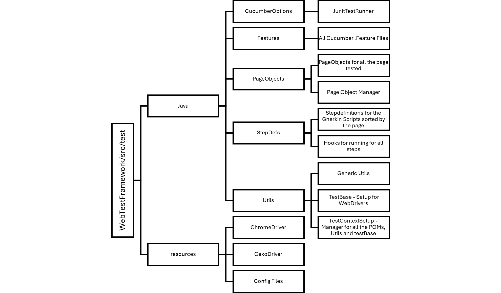

# Project2WebTestFrameWork

## Overview

This project aims to create and implement a automated testing framework for the most common user journeys for the BookCart web application (https://bookcart.azurewebsites.net/). This framework was created using a BDD drive approach, using selenium and structured using the Page Object Model format.

## Framework Architecture and Setup

-   Cucumber: For writing BDD test scenarios in Gherkin syntax. These are located WebTestFramework\src\test\java\features
-   Selenium Web Driver: For implementing automated web tests.
-   JUnit: For writing and executing tests. These are located WebTestFramework\src\test\java\stepDefs
-   Cucumber Reports: For test reports.
-   GitHub Actions: For integrating tests with a CI pipeline and automating test execution.
-   Maven: This manages all the dependencies and helps run all the tests. The pom file is located WebTestFramework\pom.xml

### Project Structure



### Prerequisite

-   Java JDK 21: Ensure the Environment variables are set correctly
-   Maven: Ensure Maven is installed and its PATH is set
-   Git: install git for cloning the repository
-   A compatible web browser. All test created by me work for Chrome and FireFox

## Setup instructions

1. Clone the repository

```
git clone https://github.com/Sturgeon2962-SpartaGlobal/Project2WebTestFrameWork.git
git cd <RepoName>
```

RepoName should be the name of the repository you created

2. Install dependencies and build

```
mvn clean install
```

This will install the dependencies defined by the pom.xml file

## Running Tests

To run all test use

```
mvn test
```

To run a specific file or test you can use tags, the current tags are
|Feature File|Individual Test|
|----------|-----------|
|@AddToCart|@SingleBook|
||@MultipleBooks|
|@BookSearch|@ValidSearch|
||@InvalidSearch|
|@CheckoutProcess|@ValidPurchase|
||@InvalidPurchase|
|@UserLogin|@ValidUser|
||@InvalidUser|
||@NoPassword|
|@UserRegistration|@NewUserRegistration|
||@InvalidUserRegistration|
||@InvalidPassword|

To run using tags use the following:

```
mvn test -Dcucumber.filter.tags="@Tag"
```

To run using single feature file

```
mvn test -Dcucumber.features="src\test\java\features\Filename.feature"
```

## How to contribute

Help me improve this testing framework!

1. Fork the repository
2. Create a new branch for your feature
3. Create your tests:
    - Write your code. If you can contiue using the BDD style and the Page Object Models.
    - Create a new feature files and stepdefs if they are necessary.
    - Run locally before pushing to Github
4. Push to github with an appropriate message, with clear and concise information about what you have added
5. Create a Pull Request to the original Repository

## License

MIT LIcense
